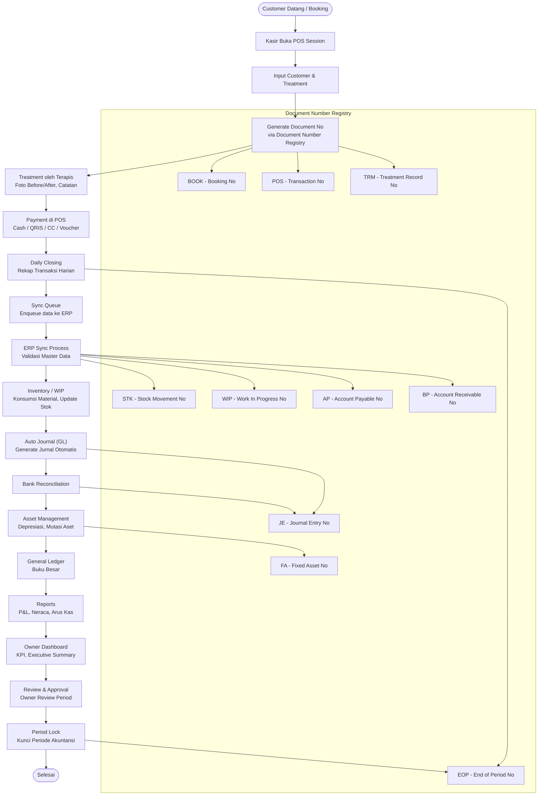
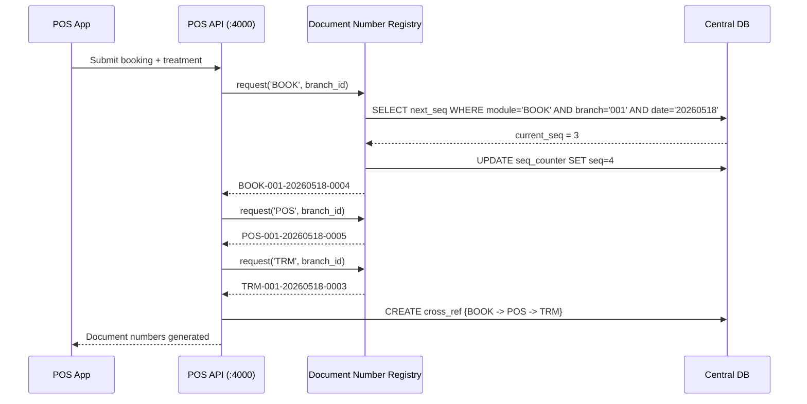
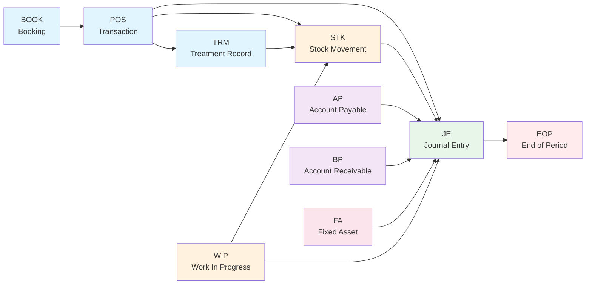
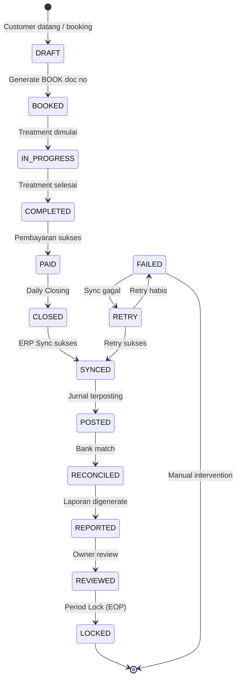

# Data Flow — Alur Data Berdasarkan BPMN Process Flow

## 1. Diagram Alur Proses End-to-End

---

## 2. Alur Data Step-by-Step

### Step 1: Customer Datang / Booking

| Aspek | Detail |
|---|---|
| **Aktor** | Customer, Kasir |
| **Aksi** | Customer datang langsung (walk-in) atau booking via telepon/aplikasi |
| **Sistem** | POS App → POS API |
| **Data** | Nama customer, nomor telepon, treatment yang diinginkan, terapis preferensi, waktu |
| **Output** | Data customer tersimpan / dipilih dari database |

### Step 2: Kasir Input di POS

| Aspek | Detail |
|---|---|
| **Aktor** | Kasir |
| **Aksi** | Buka POS Session, pilih atau buat customer baru, pilih treatment, pilih staff terapis, pilih bed |
| **Sistem** | POS App → POS API (`:4000`) |
| **Data** | `branch_id`, `cashier_id`, `customer_id`, `treatment_items[]`, `therapist_id`, `bed_id` |
| **Validasi** | Ketersediaan bed, jadwal terapis, stok treatment material |
| **Output** | POS Transaction (status: `draft`) |

### Step 3: Generate Document Number

**Ini adalah titik kritis dalam alur data.** Setiap transaksi mendapatkan nomor dokumen unik.

| Aspek | Detail |
|---|---|
| **Sistem** | POS API → Document Number Registry |
| **Format** | `MODULE-BRANCH-DATE-SEQ` |
| **Contoh** | `POS-001-20260518-0001` |
| **Dokumen yang dibuat** | `BOOK` (Booking No), `POS` (Transaction No), `TRM` (Treatment Record No) |
| **Cross-Reference** | `BOOK` → `POS` → `TRM` tercatat di Document Cross Reference Store |

**Flow detail:**

### Step 4: Treatment oleh Terapis

| Aspek | Detail |
|---|---|
| **Aktor** | Terapis |
| **Aksi** | Check-in pasien ke bed, lakukan treatment, isi Treatment Record (foto before/after, catatan), update status |
| **Sistem** | POS App → POS API |
| **Data** | `treatment_record_id`, `therapist_notes`, `before_photos[]`, `after_photos[]`, `consent_form`, `material_used[]` |
| **Status Update** | `in_progress` → `completed` |
| **Cross-Reference** | `TRM` terhubung ke `POS` dan `BOOK` |

### Step 5: Pembayaran (Payment)

| Aspek | Detail |
|---|---|
| **Aktor** | Kasir |
| **Aksi** | Pilih metode pembayaran, proses pembayaran |
| **Sistem** | POS App → POS API |
| **Metode** | Cash (hitung kembalian), QRIS (generate QR), Kartu Kredit/Debit (approval code), Voucher (validasi & redeem), Split Payment |
| **Data** | `payment_method`, `amount`, `reference_number`, `approval_code` |
| **Pajak** | PPN dihitung otomatis berdasarkan tax master |
| **Output** | POS Transaction (status: `paid`), struk (thermal/PDF) |

### Step 6: Daily Closing

| Aspek | Detail |
|---|---|
| **Aktor** | Kasir / Supervisor |
| **Aksi** | Tutup shift kasir, rekapitulasi transaksi harian |
| **Sistem** | POS App → POS API |
| **Data** | `closing_balance` (fisik), `expected_balance` (sistem), `difference`, `POS_session_id` |
| **Validasi** | Selisih antara closing balance fisik dengan expected balance |
| **Dokumen Baru** | `EOP` (End of Period) — nomor dokumen untuk periode yang ditutup |
| **Output** | POS Session (status: `closed`), EOP document |

### Step 7: Sync Queue — Enqueue ke ERP

| Aspek | Detail |
|---|---|
| **Sistem** | POS API → Sync Queue |
| **Data** | `queue_id`, `source: POS`, `target: ERP`, `action: sync`, `payload: {transactions[], sessions[], adjustments[]}` |
| **Status** | `pending` |
| **Trigger** | Daily Closing selesai + real-time untuk transaksi individual |
| **Retry** | Maksimal 3 kali percobaan dengan exponential backoff |

### Step 8: ERP Sync Process

| Aspek | Detail |
|---|---|
| **Sistem** | Sync Queue → ERP API (`:5000`) |
| **Aksi** | Dequeue data, validasi master data (product, customer, COA), transform ke format ERP |
| **Data** | Seluruh transaksi POS yang sudah di-closing |
| **Validasi** | Pastikan semua `product_id` ada di ERP, `customer_id` valid, `branch_id` terdaftar |
| **Status** | `processing` → `success` / `failed` |
| **Integration Log** | Catat timestamp, source, target, action, status, payload summary |

### Step 9: Inventory / WIP Update

| Aspek | Detail |
|---|---|
| **Sistem** | ERP API |
| **Aksi** | Update stok berdasarkan konsumsi material treatment, update WIP |
| **Data** | `stk_movement[]`: material yang terpakai dari BOM treatment, `wip_record`: tracking produksi |
| **Dokumen Baru** | `STK` (Stock Movement No), `WIP` (Work In Progress No) |
| **Cross-Reference** | `STK` ← `TRM` ← `POS` ← `BOOK` |

### Step 10: Auto Journal (Jurnal Otomatis)

| Aspek | Detail |
|---|---|
| **Sistem** | ERP API |
| **Aksi** | Generate jurnal akuntansi otomatis dari transaksi POS |
| **Data** | Debit: Kas/Bank, Kredit: Revenue (Pendapatan), Debit: Piutang PPN, Kredit: PPN Keluaran |
| **Dokumen Baru** | `JE` (Journal Entry No) |
| **Cross-Reference** | `JE` ← `POS` ← `BOOK` |

**Contoh jurnal:**

| Akun | Debit | Kredit |
|---|---|---|
| Kas (1-110) | Rp 550.000 | |
| Pendapatan Treatment (4-100) | | Rp 500.000 |
| PPN Keluaran (2-210) | | Rp 50.000 |

### Step 11: Bank Reconciliation

| Aspek | Detail |
|---|---|
| **Sistem** | ERP API — Modul Bank Reconciliation |
| **Aksi** | Cocokkan transaksi POS dengan statement bank, input adjustment jika ada |
| **Data** | `bank_statement[]`, `system_transaction[]`, `matched[]`, `unmatched[]`, `adjustment_je` |
| **Cross-Reference** | `JE` (adjustment) ← Bank Reconciliation ← `POS` |

### Step 12: Asset Management

| Aspek | Detail |
|---|---|
| **Sistem** | ERP API — Modul Asset Management |
| **Aksi** | Catat pembelian aset baru, hitung depresiasi periodik, catat mutasi aset |
| **Dokumen Baru** | `FA` (Fixed Asset No) |
| **Cross-Reference** | `FA` ← `AP` (pembelian aset) ← `STK` (jika ada) |

### Step 13: General Ledger (GL)

| Aspek | Detail |
|---|---|
| **Sistem** | ERP API |
| **Aksi** | Posting semua jurnal ke Buku Besar, generate neraca saldo |
| **Data** | Semua `JE` dari step 10 + jurnal manual + adjustment bank + depresiasi aset |
| **Validasi** | Debit = Kredit, saldo akhir periode |

### Step 14: Reports

| Aspek | Detail |
|---|---|
| **Sistem** | Reporting Data Mart |
| **Aksi** | Aggregasi data dari GL, Inventory, POS untuk laporan |
| **Laporan** | Laba-Rugi (P&L), Neraca, Arus Kas, Lapenjualan per cabang, Laporan Stok, Laporan Treatment |
| **Frekuensi** | Real-time dashboard, harian (batch 00:00), periodik (bulanan) |

### Step 15: Owner Dashboard

| Aspek | Detail |
|---|---|
| **Akses** | Owner Dashboard (`:3002`) → Gateway → ERP API + Reporting Data Mart |
| **Tampilan** | Executive KPI: revenue, profit margin, customer count, average ticket size, bed utilization, staff performance |
| **Data** | Aggregasi dari Reporting Data Mart + data real-time selected |

### Step 16: Review & Approval

| Aspek | Detail |
|---|---|
| **Aktor** | Owner / Manajemen |
| **Aksi** | Review laporan, review transaksi, review treatment records |
| **Sistem** | Owner Dashboard → Approval Engine |
| **Data** | Reports, audit trail, cross-reference dokumen |

### Step 17: Period Lock

| Aspek | Detail |
|---|---|
| **Aktor** | Owner (via Approval Engine) |
| **Aksi** | Kunci periode akuntansi setelah review selesai |
| **Sistem** | Approval Engine → ERP API |
| **Dokumen Baru** | `EOP` (End of Period) — nomor dokumen final untuk periode |
| **Efek** | Tidak ada transaksi baru yang bisa masuk ke periode terkunci, semua jurnal final |
| **Cross-Reference** | `EOP` mencakup semua `JE`, `POS`, `STK`, `WIP`, `FA` dalam periode tersebut |

---

## 3. Peran Document Number Registry dalam Alur Data

Document Number Registry adalah **jantung konektivitas** yang menghubungkan seluruh modul. Berikut ringkasan keterhubungan:

**Key Points:**

1. **BOOK → POS** — Setiap booking menghasilkan POS transaction
2. **POS → TRM** — Setiap POS transaction menghasilkan treatment record
3. **POS / TRM → STK** — Konsumsi material menghasilkan stock movement
4. **POS → JE** — Setiap pembayaran menghasilkan jurnal akuntansi
5. **STK → JE** — Penyesuaian stok juga masuk ke jurnal
6. **AP / BP → JE** — Hutang dan piutang masuk ke jurnal
7. **FA → JE** — Depresiasi aset masuk ke jurnal
8. **WIP → STK / JE** — Produksi WIP mempengaruhi stok dan jurnal
9. **Semua → EOP** — Period Lock mengumpulkan semua dokumen dalam periode

---

## 4. Diagram State Machine Data Flow

