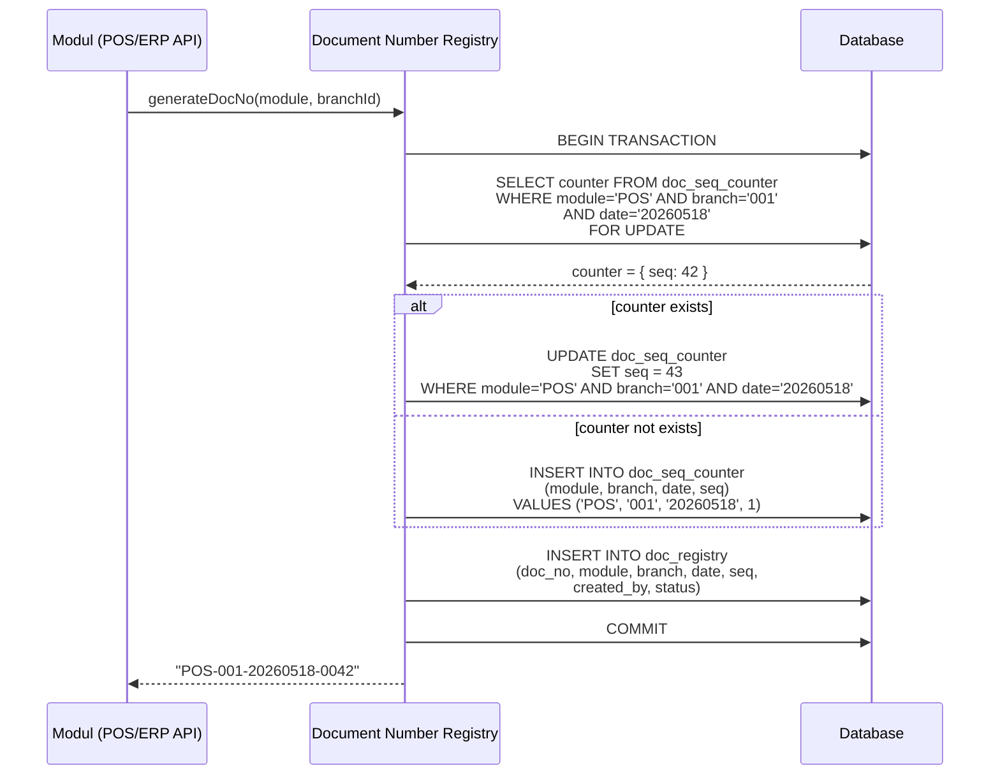
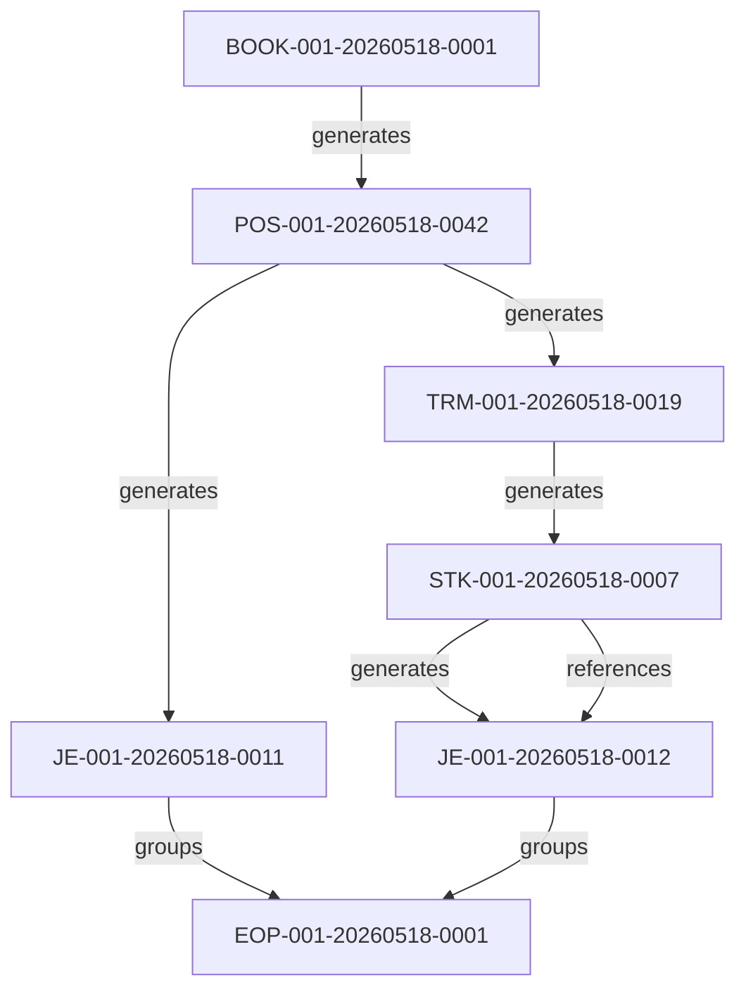

# Document Key System — Sistem Document Number Registry

## 1. Overview

**Document Number Registry** adalah sistem terpusat untuk menghasilkan, mengelola, dan melacak seluruh nomor dokumen di Salon Eyelash POS/ERP System. Setiap dokumen dalam sistem — dari booking pelanggan hingga period lock akuntansi — memiliki nomor unik yang terstandarisasi.

### 1.1 Tujuan

- **Unikasi** — Menjamin tidak ada duplikasi nomor dokumen di seluruh sistem dan seluruh cabang
- **Standardisasi** — Format nomor yang konsisten antar modul
- **Traceability** — Kemampuan melacak asal-usul setiap dokumen secara penuh (audit trail)
- **Cross-Referencing** — Menghubungkan dokumen dari modul berbeda yang terkait secara bisnis
- **Sequencing** — Urutan kronologis yang jelas per modul, cabang, dan tanggal

### 1.2 Prinsip Desain

1. **Idempotent** — Setiap request generate menghasilkan nomor yang deterministik dan tidak bisa di-replay
2. **Atomic** — Operasi increment sequence menggunakan database transaction (SELECT ... FOR UPDATE)
3. **Decentralized Generation** — Nomor digenerate di sisi server, bukan client
4. **Immutable** — Setelah digenerate, nomor dokumen tidak bisa diubah
5. **Auditable** — Setiap generate dan penggunaan nomor tercatat

---

## 2. Format Key

### 2.1 Struktur

```
MODULE - BRANCH - DATE - SEQ
```

| Segmen | Panjang | Format | Contoh | Deskripsi |
|---|---|---|---|---|
| **MODULE** | 3 karakter | `[A-Z]{3}` | `POS` | Kode modul asal dokumen |
| **BRANCH** | 3 digit | `[0-9]{3}` | `001` | Kode cabang |
| **DATE** | 8 digit | `YYYYMMDD` | `20260518` | Tanggal pembuatan dokumen |
| **SEQ** | 4 digit | `[0-9]{4}` | `0001` | Nomor urut (reset harian per modul+cabang) |

### 2.2 Contoh Lengkap

| Dokumen | Nomor | Makna |
|---|---|---|
| Booking Customer | `BOOK-001-20260518-0001` | Booking pertama di cabang 001, 18 Mei 2026 |
| POS Transaction | `POS-001-20260518-0042` | Transaksi POS ke-42 di cabang 001 hari itu |
| Treatment Record | `TRM-001-20260518-0019` | Treatment record ke-19 di cabang 001 hari itu |
| Stock Movement | `STK-001-20260518-0007` | Mutasi stok ke-7 di cabang 001 hari itu |

### 2.3 Aturan Sequence

- **Reset harian** — Sequence restart dari `0001` setiap hari per kombinasi `MODULE + BRANCH + DATE`
- **Gap handling** — Jika ada kegagalan transaksi, sequence yang sudah di-increment tetap dianggap terpakai (no rollback of sequence)
- **Overflow** — Jika melebihi `9999` dalam satu hari, sistem akan throw error (kebutuhan bisnis: maksimal 9.999 dokumen per modul+cabang per hari)

---

## 3. Document Key Types

### 3.1 Daftar Lengkap Key Types

| Kode | Modul | Nama Dokumen | Kegunaan | Contoh |
|---|---|---|---|---|
| **BOOK** | POS | Booking Number | Mencatat janji temu customer, alokasi terapis dan bed | `BOOK-001-20260518-0001` |
| **POS** | POS | POS Transaction Number | Nomor transaksi POS (pembelian treatment) | `POS-001-20260518-0042` |
| **TRM** | POS | Treatment Record Number | Catatan treatment oleh terapis (foto, catatan, consent) | `TRM-001-20260518-0019` |
| **STK** | ERP | Stock Movement Number | Mutasi stok (penerimaan, pengeluaran, opname, transfer) | `STK-001-20260518-0007` |
| **WIP** | ERP | Work In Progress Number | Tracking produksi/racikan produk, konsumsi BOM | `WIP-001-20260518-0003` |
| **AP** | ERP | Account Payable Number | Hutang usaha ke supplier, tagihan, payment AP | `AP-001-20260518-0002` |
| **BP** | ERP | Account Receivable Number | Piutang usaha, invoice customer non-POS, payment BP | `BP-001-20260518-0001` |
| **JE** | ERP | Journal Entry Number | Jurnal akuntansi (auto journal + manual journal) | `JE-001-20260518-0011` |
| **FA** | ERP | Fixed Asset Number | Pencatatan aset tetap, depresiasi, mutasi aset | `FA-001-20260518-0001` |
| **EOP** | ERP | End of Period Number | Penutupan periode akuntansi (period lock) | `EOP-001-20260518-0001` |

### 3.2 Detail Setiap Key Type

#### BOOK — Booking Number

| Atribut | Nilai |
|---|---|
| **Dibuat oleh** | POS API saat booking dibuat |
| **Terkait dengan** | `POS` (saat check-in), `TRM` (saat treatment) |
| **Status** | `pending` → `confirmed` → `checked_in` → `completed` → `cancelled` |
| **Data disimpan** | `customer_id`, `treatment_items[]`, `therapist_id`, `bed_id`, `booked_time`, `notes` |

#### POS — POS Transaction Number

| Atribut | Nilai |
|---|---|
| **Dibuat oleh** | POS API saat transaksi dimulai |
| **Terkait dengan** | `BOOK` (jika dari booking), `TRM`, `STK` (material consumption), `JE` (jurnal) |
| **Status** | `draft` → `in_progress` → `paid` → `voided` |
| **Data disimpan** | `customer_id`, `items[]`, `subtotal`, `tax`, `total`, `payment_method`, `cashier_id` |

#### TRM — Treatment Record Number

| Atribut | Nilai |
|---|---|
| **Dibuat oleh** | POS API saat treatment dimulai |
| **Terkait dengan** | `BOOK` (booking asal), `POS` (transaksi), `STK` (material used) |
| **Status** | `assigned` → `in_progress` → `completed` → `cancelled` |
| **Data disimpan** | `therapist_id`, `treatment_id`, `before_photos[]`, `after_photos[]`, `consent_form`, `notes`, `material_used[]` |

#### STK — Stock Movement Number

| Atribut | Nilai |
|---|---|
| **Dibuat oleh** | ERP API saat ada mutasi stok |
| **Terkait dengan** | `TRM` (consumption), `WIP` (production), `AP` (purchase receipt), `JE` (adjustment) |
| **Tipe Mutasi** | `in` (penerimaan), `out` (pengeluaran), `transfer` (antar cabang), `adjustment` (opname), `consumption` (treatment) |
| **Status** | `draft` → `posted` → `cancelled` |

#### WIP — Work In Progress Number

| Atribut | Nilai |
|---|---|
| **Dibuat oleh** | ERP API saat proses produksi dimulai |
| **Terkait dengan** | `STK` (material consumed + finished goods), `JE` (cost accounting) |
| **Status** | `planned` → `in_progress` → `completed` → `cancelled` |

#### AP — Account Payable Number

| Atribut | Nilai |
|---|---|
| **Dibuat oleh** | ERP API saat ada hutang baru |
| **Terkait dengan** | `STK` (purchase receipt), `JE` (jurnal hutang) |
| **Tipe** | `purchase` (pembelian), `expense` (biaya), `other` (lainnya) |
| **Status** | `open` → `partial_paid` → `paid` → `cancelled` |

#### BP — Account Receivable Number (Piutang)

| Atribut | Nilai |
|---|---|
| **Dibuat oleh** | ERP API saat ada piutang baru |
| **Terkait dengan** | `POS` (jika non-cash), `JE` (jurnal piutang) |
| **Tipe** | `invoice` (non-POS), `credit_sale` (penjualan kredit), `other` |
| **Status** | `open` → `partial_paid` → `paid` → `cancelled` |

#### JE — Journal Entry Number

| Atribut | Nilai |
|---|---|
| **Dibuat oleh** | ERP API — Auto Journal Engine |
| **Terkait dengan** | Semua modul — setiap transaksi bisnis berakhir di jurnal |
| **Tipe** | `auto` (otomatis dari POS/STK/AP/BP/FA), `manual` (input manual accounting) |
| **Status** | `draft` → `posted` → `reversed` |
| **Aturan** | Debit harus sama dengan Kredit |

#### FA — Fixed Asset Number

| Atribut | Nilai |
|---|---|
| **Dibuat oleh** | ERP API — Asset Management |
| **Terkait dengan** | `AP` (pembelian aset), `JE` (depresiasi) |
| **Tipe** | `acquisition`, `depreciation`, `disposal`, `transfer` |
| **Status** | `active` → `depreciating` → `disposed` |

#### EOP — End of Period Number

| Atribut | Nilai |
|---|---|
| **Dibuat oleh** | ERP API — Period Lock process |
| **Terkait dengan** | Semua dokumen dalam periode yang dikunci |
| **Data** | `period_start`, `period_end`, `locked_by`, `locked_at`, `document_count`, `total_revenue`, `total_expense` |
| **Efek** | Setelah EOP digenerate, periode terkunci dan tidak bisa dimodifikasi |

---

## 4. Cara Generate

### 4.1 Algoritma Generate



### 4.2 Pseudo-code

```
function generateDocNo(module, branchId):
    date = today().format('YYYYMMDD')
    branchCode = getBranchCode(branchId)

    transaction.begin()

    counter = doc_seq_counter.findOrCreate(
        module = module,
        branch = branchCode,
        date = date,
        defaults = { seq: 0 }
    )

    if counter.seq >= 9999:
        transaction.rollback()
        throw Error("Sequence overflow for " + module + "-" + branchCode + "-" + date)

    counter.seq += 1
    counter.save()

    seq_str = counter.seq.toString().padStart(4, '0')
    docNo = `${module}-${branchCode}-${date}-${seq_str}`

    doc_registry.create(
        doc_no: docNo,
        module: module,
        branch: branchCode,
        date: date,
        seq: counter.seq,
        created_by: currentUserId,
        status: 'active'
    )

    transaction.commit()

    return docNo
```

### 4.3 Database Schema

```sql
-- Tabel counter sequence (untuk generate)
CREATE TABLE doc_seq_counter (
    module VARCHAR(3) NOT NULL,
    branch VARCHAR(3) NOT NULL,
    date DATE NOT NULL,
    seq INTEGER NOT NULL DEFAULT 0,
    updated_at TIMESTAMP NOT NULL DEFAULT NOW(),
    PRIMARY KEY (module, branch, date)
);

-- Tabel registry dokumen (untuk audit & cross-reference)
CREATE TABLE doc_registry (
    id UUID PRIMARY KEY DEFAULT gen_random_uuid(),
    doc_no VARCHAR(30) NOT NULL UNIQUE,
    module VARCHAR(3) NOT NULL,
    branch VARCHAR(3) NOT NULL,
    date DATE NOT NULL,
    seq INTEGER NOT NULL,
    entity_id UUID,         -- FK ke tabel spesifik (pos_transaction.id, dll)
    entity_type VARCHAR(50), -- nama tabel entitas
    created_by UUID NOT NULL,
    created_at TIMESTAMP NOT NULL DEFAULT NOW(),
    status VARCHAR(20) NOT NULL DEFAULT 'active',
    notes TEXT
);

-- Tabel cross-reference
CREATE TABLE doc_cross_reference (
    id UUID PRIMARY KEY DEFAULT gen_random_uuid(),
    source_doc_no VARCHAR(30) NOT NULL,
    target_doc_no VARCHAR(30) NOT NULL,
    relation_type VARCHAR(30) NOT NULL, -- 'generates', 'references', 'reverses'
    created_at TIMESTAMP NOT NULL DEFAULT NOW(),
    FOREIGN KEY (source_doc_no) REFERENCES doc_registry(doc_no),
    FOREIGN KEY (target_doc_no) REFERENCES doc_registry(doc_no)
);

-- Index untuk lookup cepat
CREATE INDEX idx_doc_registry_module ON doc_registry(module);
CREATE INDEX idx_doc_registry_date ON doc_registry(date);
CREATE INDEX idx_doc_registry_entity ON doc_registry(entity_id, entity_type);
CREATE INDEX idx_doc_cross_ref_source ON doc_cross_reference(source_doc_no);
CREATE INDEX idx_doc_cross_ref_target ON doc_cross_reference(target_doc_no);
```

---

## 5. Cross-Reference System

Cross-reference adalah mekanisme yang menghubungkan satu dokumen dengan dokumen lain yang terkait secara bisnis.

### 5.1 Contoh Cross-Reference Chain

**Skenario: Customer booking treatment, check-in, treatment, bayar, stok terpakai, jurnal terposting**

```
BOOK-001-20260518-0001  ──generates──► POS-001-20260518-0042
POS-001-20260518-0042   ──generates──► TRM-001-20260518-0019
TRM-001-20260518-0019   ──generates──► STK-001-20260518-0007  (material consumed)
POS-001-20260518-0042   ──generates──► JE-001-20260518-0011   (auto journal)
STK-001-20260518-0007   ──references──► JE-001-20260518-0012  (inventory adjustment)
JE-001-20260518-0011    ──references──► EOP-001-20260518-0001  (period lock)
JE-001-20260518-0012    ──references──► EOP-001-20260518-0001  (period lock)
```

### 5.2 Relation Types

| Type | Deskripsi | Contoh |
|---|---|---|
| `generates` | Dokumen A menghasilkan / membuat dokumen B | `BOOK` → `POS` |
| `references` | Dokumen A merujuk ke dokumen B | `TRM` → `BOOK` |
| `reverses` | Dokumen A membalikkan dokumen B | `JE` reversal → `JE` original |
| `groups` | Dokumen A mengelompokkan beberapa dokumen B | `EOP` → `JE`, `POS`, `STK` |

### 5.3 Diagram Cross-Reference



---

## 6. Audit Trail

### 6.1 Apa yang Dicatat

Setiap aksi terhadap Document Number Registry dicatat di `doc_registry` dan `integration_log`:

| Event | Data yang Dicatat |
|---|---|
| **Generate** | `doc_no`, `module`, `branch`, `date`, `seq`, `created_by`, `created_at`, `status: active` |
| **Link ke Entity** | `entity_id`, `entity_type` — diupdate saat dokumen di-link ke record bisnis |
| **Cancel / Void** | `status: cancelled`, `cancelled_at`, `cancelled_by`, `cancellation_reason` |
| **Cross-Reference** | Tercatat di `doc_cross_reference` dengan `source`, `target`, `relation_type` |
| **Error** | Integration Log: `failed_generate`, `sequence_error`, `duplicate_doc_no` |

### 6.2 Contoh Audit Log

```
2026-05-18 09:15:23 | POS API | DNR | generate | SUCCESS | BOOK-001-20260518-0001
2026-05-18 09:15:24 | POS API | DNR | generate | SUCCESS | POS-001-20260518-0042
2026-05-18 09:15:25 | POS API | DNR | generate | SUCCESS | TRM-001-20260518-0019
2026-05-18 09:15:25 | POS API | DNR | cross-ref | SUCCESS | BOOK → POS
2026-05-18 09:15:26 | POS API | DNR | cross-ref | SUCCESS | POS → TRM
2026-05-18 10:30:00 | ERP API | DNR | generate | SUCCESS | STK-001-20260518-0007
2026-05-18 10:30:01 | ERP API | DNR | cross-ref | SUCCESS | TRM → STK
2026-05-18 10:30:05 | ERP API | DNR | generate | SUCCESS | JE-001-20260518-0011
2026-05-18 10:30:06 | ERP API | DNR | cross-ref | SUCCESS | POS → JE
2026-05-18 23:59:00 | ERP API | DNR | generate | SUCCESS | EOP-001-20260518-0001
2026-05-18 23:59:01 | ERP API | DNR | cross-ref | SUCCESS | EOP groups [JE-001, JE-002, STK-007, ...]
```

---

## 7. Query & Reporting

### 7.1 Melacak Dokumen Berdasarkan Entity ID

```sql
SELECT * FROM doc_registry
WHERE entity_id = '550e8400-e29b-41d4-a716-446655440000'
  AND entity_type = 'pos_transaction';
```

### 7.2 Melihat Semua Dokumen Terkait

```sql
-- Cari semua dokumen yang terkait dengan POS-001-20260518-0042
SELECT target_doc_no, relation_type
FROM doc_cross_reference
WHERE source_doc_no = 'POS-001-20260518-0042'

UNION

SELECT source_doc_no, relation_type
FROM doc_cross_reference
WHERE target_doc_no = 'POS-001-20260518-0042';
```

### 7.3 Statistik Harian per Modul

```sql
SELECT module, branch, COUNT(*) as doc_count, MAX(seq) as max_seq
FROM doc_registry
WHERE date = CURRENT_DATE
GROUP BY module, branch
ORDER BY module, branch;
```

### 7.4 Audit Trail untuk Satu Dokumen

```sql
SELECT dr.*, dcr.source_doc_no, dcr.target_doc_no, dcr.relation_type
FROM doc_registry dr
LEFT JOIN doc_cross_reference dcr
    ON dcr.source_doc_no = dr.doc_no OR dcr.target_doc_no = dr.doc_no
WHERE dr.doc_no = 'POS-001-20260518-0042'
ORDER BY dcr.created_at;
```

---

## 8. Error Handling

| Error | Penyebab | Penanganan |
|---|---|---|
| `SEQUENCE_OVERFLOW` | Seq mencapai 9999 dalam satu hari | Throw error, manual intervention untuk reset atau perluas format |
| `DUPLICATE_DOC_NO` | Race condition (sangat jarang) | Retry generate dengan sequence baru |
| `MODULE_NOT_FOUND` | Kode module tidak dikenal | Validasi di API layer sebelum panggil DNR |
| `INVALID_BRANCH` | Kode cabang tidak valid | Validasi branch_id sebelum generate |
| `DATE_MISMATCH` | Tanggal tidak sesuai dengan sistem | Force menggunakan server date |

---

## 9. Best Practices

1. **Jangan generate nomor di client** — Selalu melalui API untuk menjaga atomicity
2. **Gunakan database transaction** — Untuk mencegah race condition
3. **Log setiap generate** — Untuk audit trail dan troubleshooting
4. **Cross-reference segera** — Setelah generate, langsung buat relasi ke dokumen terkait
5. **Immediate link ke entity** — Update `entity_id` dan `entity_type` sesegera mungkin
6. **No recycle** — Nomor yang sudah digenerate tidak boleh digunakan ulang meskipun dibatalkan
7. **Monitoring sequence** — Pantau sequence harian untuk antisipasi overflow (bisnis besar)
