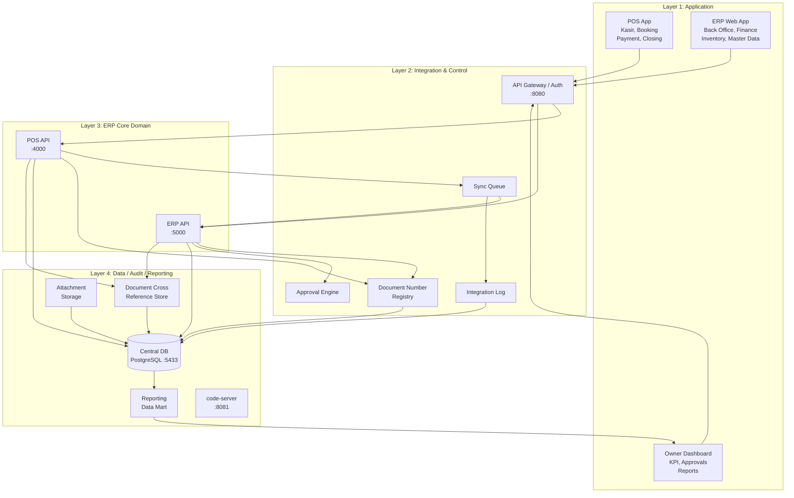
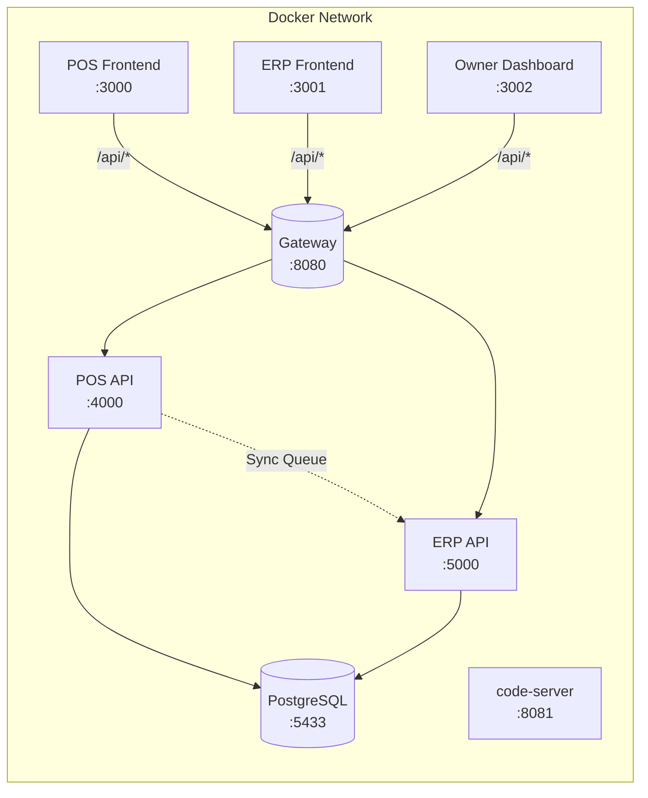

# System Overview — Arsitektur Salon Eyelash POS/ERP

## 1. Arsitektur 4 Layer

Sistem dibangun di atas **4 layer arsitektur** yang memisahkan concern antar modul, memungkinkan skabilitas, keamanan, dan maintainability yang baik.

### 1.1 Layer 1 — Application (Aplikasi Pengguna)

Layer ini berisi semua antarmuka pengguna (User Interface) yang berinteraksi langsung dengan personel salon.

#### POS App (Point of Sale)

Aplikasi utama untuk operasional **front office** — interaksi langsung dengan pelanggan.

| Fitur | Deskripsi |
|---|---|
| **Kasir** | Buka/tutup shift kasir (POS Session), hitung setoran awal/akhir, validasi selisih kas. |
| **Booking** | Quick booking untuk walk-in, scheduled booking untuk janji temu dengan terapis dan bed tertentu. |
| **Treatment Order** | Pilih customer, pilih treatment + add-on, assign staff terapis, generate nomor dokumen. |
| **Payment** | Cash, QRIS, Kartu Kredit/Debit, Voucher, Split Payment. Hitung PPN otomatis. |
| **Daily Closing** | Rekapitulasi transaksi harian, tutup periode POS, kirim antrian ke ERP Sync. |

#### ERP Web App (Back Office)

Aplikasi **back office** untuk pengelolaan operasional dan keuangan secara menyeluruh.

| Modul | Deskripsi |
|---|---|
| **Back Office** | Manajemen cabang, user, role, shift, bed, treatment catalog. |
| **Finance** | AP (Accounts Payable), AR (Accounts Receivable), Jurnal Umum, Buku Besar (GL), Neraca, Laba-Rugi. |
| **Inventory** | Stok masuk/keluar, opname, transfer antar cabang, batch/lot tracking, reorder point. |
| **WIP / Manufacture** | Work In Progress — tracking produksi/racikan produk, BOM (Bill of Materials), konsumsi material. |
| **Master Data** | Product, Customer, Supplier, Treatment, Tax, Voucher, COA (Chart of Accounts). |
| **Bank Reconciliation** | Rekonsiliasi transaksi bank dengan jurnal sistem. |
| **Asset Management** | Pencatatan aset tetap (fixed asset), depresiasi, mutasi aset. |

#### Owner Dashboard

**Executive dashboard** untuk pemilik / manajemen puncak.

| Fitur | Deskripsi |
|---|---|
| **Executive KPI** | Laba rugi real-time, revenue per cabang, tren penjualan, utilisasi bed, performa staff. |
| **Approval Center** | Approval period lock, approval pembelian di atas limit, approval adjustment stok. |
| **Reports** | Laporan operasional harian/mingguan/bulanan, laporan keuangan (P&L, Neraca, Arus Kas), laporan inventaris. |
| **Review** | Review treatment records, audit trail transaksi, review dokumen cross-reference. |

### 1.2 Layer 2 — Integration & Control

Layer middleware yang mengatur komunikasi, keamanan, sinkronisasi, dan kontrol proses bisnis antar aplikasi.

#### API Gateway / Auth

- **Port**: `:8080`
- **Teknologi**: Python Gateway
- **Fungsi**: 
  - Single entry point untuk semua request dari aplikasi frontend
  - Authentication & Authorization (JWT / OAuth2)
  - Rate limiting, request validation, logging
  - Routing ke POS API (`:4000`) atau ERP API (`:5000`)
  - CORS management

#### Sync Queue

- **Fungsi**:
  - Antrian sinkronisasi data dari POS ke ERP
  - Menjamin data POS tidak hilang jika ERP sedang sibuk / down
  - Retry mechanism dengan exponential backoff
  - Status tracking: `pending → processing → success / failed`
- **Trigger**: Daily Closing, real-time transaction sync

#### Integration Log

- **Fungsi**:
  - Mencatat seluruh aktivitas integrasi antar modul
  - Audit trail untuk troubleshooting
  - Log format: `timestamp | source | target | action | status | payload_summary | error_message`
  - Retensi log: 90 hari (aktif), 1 tahun (archive)

#### Document Number Registry

- **Fungsi**:
  - Generator nomor dokumen terpusat dengan format: `MODULE-BRANCH-DATE-SEQ`
  - Menjamin keunikan nomor dokumen di seluruh sistem
  - Cross-reference antar dokumen dari modul berbeda
  - Audit trail pembuatan dan penggunaan nomor dokumen
- **Detail**: Lihat [Dokumen Document Key System](./document-key-system.md)

#### Approval Engine

- **Fungsi**:
  - Workflow approval untuk transaksi yang memerlukan otorisasi
  - Rule-based: threshold amount, role-based, multi-level approval
  - Notifikasi ke approver (Owner Dashboard)
  - Contoh penggunaan: Period Lock approval, pembelian > limit, penyesuaian stok, pembatalan transaksi

### 1.3 Layer 3 — ERP Core Domain

Layer bisnis backend yang berisi logika aplikasi.

#### POS API

- **Port**: `:4000`
- **Teknologi**: NestJS + Prisma
- **Fungsi**:
  - Logika bisnis POS: booking, treatment order, payment, daily closing
  - Generate nomor dokumen via Document Number Registry
  - Enqueue data ke Sync Queue
  - Validasi master data cache

#### ERP API

- **Port**: `:5000`
- **Teknologi**: NestJS + Prisma
- **Fungsi**:
  - Logika bisnis ERP: finance, inventory, WIP, accounting
  - Dequeue data dari Sync Queue
  - Proses posting jurnal otomatis
  - Approval workflow via Approval Engine
  - Period lock management

### 1.4 Layer 4 — Data / Audit / Reporting

Layer penyimpanan data, audit trail, dan pelaporan.

#### Central Database (PostgreSQL)

- **Port**: `:5433`
- **Fungsi**: Database utama yang menyimpan seluruh data transaksional dan master.
- **Skema Utama**:
  - `pos_*` — Tabel POS (sessions, transactions, payments, bookings)
  - `erp_*` — Tabel ERP (products, inventory, journal, assets, ap, ar)
  - `doc_registry` — Tabel Document Number Registry
  - `sync_queue` — Tabel antrian sinkronisasi
  - `integration_log` — Tabel log integrasi
  - `audit_log` — Tabel audit trail

#### Document Cross Reference Store

- **Fungsi**:
  - Menyimpan relasi antar nomor dokumen dari modul berbeda
  - Contoh: `BOOK-001-20260518-0001` (Booking) → `POS-001-20260518-0001` (POS Transaction) → `JE-001-20260518-0001` (Journal Entry)
  - Memungkinkan追溯 (traceability) penuh dari transaksi awal hingga posting akuntansi

#### Attachment Storage

- **Fungsi**:
  - Menyimpan file attachment: foto before/after treatment, scan struk, dokumen pendukung
  - Format: gambar (JPEG, PNG), PDF, dokumen office
  - Terintegrasi dengan Document Number Registry untuk linking

#### Reporting Data Mart

- **Fungsi**:
  - Data warehouse ringan untuk pelaporan dan dashboard
  - Aggregasi data dari Central DB secara periodik (near real-time)
  - Optimasi query untuk laporan KPI dan dashboard owner
  - Refresh: setiap kali daily closing + scheduled batch (setiap 30 menit)

#### Code Server

- **Port**: `:8081`
- **Fungsi**: VS Code berbasis web untuk development dan maintenance internal.

---

## 2. Port Mapping

| Service | Port | Teknologi |
|---|---|---|
| API Gateway / Auth | `8080` | Python Gateway |
| POS API | `4000` | NestJS + Prisma |
| ERP API | `5000` | NestJS + Prisma |
| Code Server | `8081` | code-server (VS Code Web) |
| PostgreSQL | `5433` | PostgreSQL 16 |
| POS Frontend | `3000` | React + Vite |
| ERP Frontend | `3001` | React + Vite |
| Owner Dashboard | `3002` | React + Vite |

---

## 3. Diagram Deployment (Docker Compose)

---

## 4. Prinsip Arsitektur

1. **Separation of Concerns** — Setiap layer memiliki tanggung jawab yang jelas dan terisolasi.
2. **Eventual Consistency** — POS dan ERP dapat beroperasi secara independen; konsistensi data dijamin melalui Sync Queue.
3. **Idempotency** — Semua operasi Sync Queue bersifat idempotent untuk mencegah duplikasi data.
4. **Auditability** — Setiap perubahan data tercatat di audit log dan Document Number Registry.
5. **Security First** — Semua akses melalui API Gateway dengan autentikasi terpusat.
6. **Single Source of Truth** — Document Number Registry sebagai sumber kebenaran untuk identitas dokumen.
